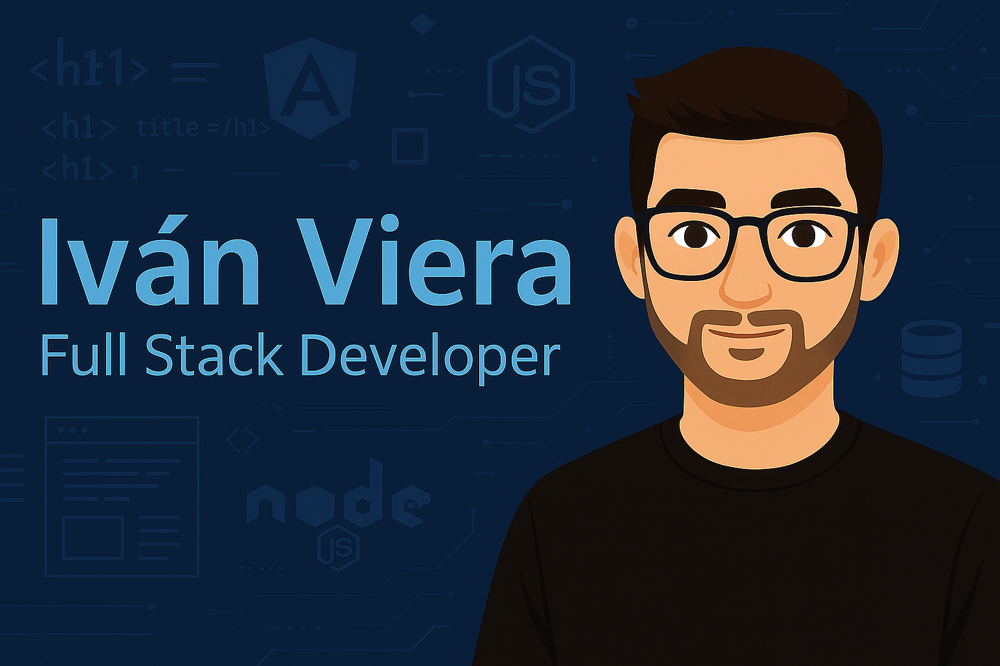

<p align="center">
  
</p>

## 👨‍💻 Iván Viera

Desarrollador Full Stack en formación, apasionado por crear soluciones que conecten tecnología y personas. Me encanta aprender, experimentar y construir herramientas que generen impacto real. Actualmente me encuentro finalizando la carrera de Analista Programador en el I.S.F.T N°93, combinando estudios formales con formación autodidacta en tecnologías modernas.

---

## 🚀 ¿Qué encontrarás en este perfil?

Una colección de proyectos reales, soluciones prácticas y experimentos personales que abarcan:

- Desarrollo de **aplicaciones web** con Angular, ASP.NET, Node.js y C#.
- Integración de **chatbots inteligentes** con Rasa IA.
- Visualización de datos con **Power BI** y modelos predictivos con **TensorFlow**.
- Diseño de interfaces responsivas y adaptables para **mejorar la experiencia del usuario**.
- Desarrollo de APIs REST, automatización de procesos con **Camunda BPM**, y manejo avanzado de bases de datos (SQL Server y PostgreSQL).

---

## 🧰 Tecnologías que domino

```bash
🔹 Frontend: Angular · HTML5 · CSS3 · JavaScript · Bootstrap · React  
🔹 Backend: C# · .NET · Node.js · ASP.NET Web API  
🔹 Bases de Datos: SQL Server · PostgreSQL  
🔹 Herramientas: Git · Postman · Power BI · RASA IA · Windows Form  
🔹 Otros: Python · TensorFlow · Camunda BPM  

```
## 🌐 Contacto y redes

- 🔗 [Sitio Web Personal](https://ivantechx.com)
- 💼 [LinkedIn](https://www.linkedin.com/in/ivanviera/)
- 🐙 [GitHub](https://github.com/ivanviera)
- ✉️ [ivanvieraosvaldo@gmail.com](mailto:ivanvieraosvaldo@gmail.com)
